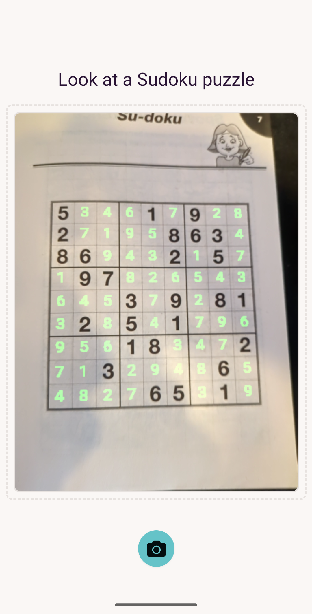

# Visual Sudoku Solver

This is the outcome of me wanting to learn a bit about computer vision and machine learning, with the aim of building a visual sudoku solver.

## How it works
At a very high level, it:
1. Uses OpenCV to identify the Sudoku Grid.
2. Uses a Keras model to determine the grid's orientation.
3. Uses another Keras model to determine the digits in the grid.
4. Solves the puzzle.
5. Renders the calculated digits at the appropriate location and perspective.

## How this repo is structured
* [notebooks](notebooks/) contains python notebooks I used while learning about OpenCV and machine learning with Keras. I went into this project with the intention of these being shareable so others could look through and understand the different concepts I learned along the way.
* [sudoku-web](sudoku-web/) contains the web app ([sudoku.dotslashdan.com](https://sudoku.dotslashdan.com)). As this was now running in the browser, I largely had to rewrite most of the OpenCV logic using OpenCV.js, though the steps taken are the same as those you'll see in the notebooks. I was able to convert the keras models to be used in the browser, so that's pretty much the same (With some additional JS glue code to pass to and from the models).

## What it looks like
It looks like this
